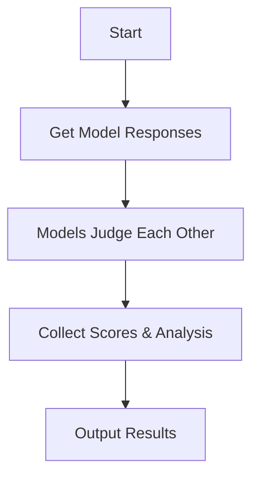

# LLM Judge

A plugin for [LLM](https://llm.datasette.io/) that enables multiple language models to evaluate each other's responses.

inspired by [llm-consortium](https://github.com/irthomasthomas/llm-consortium), with the following differences:
- single-pass evaluation vs. iterative refinement
- peer-to-peer judging vs. arbiter-based synthesis
- absolute score vs. confidence-based approach
- default judgement based on accuracy vs. bias

## Core Algorithm Flow



## Features

- **Multi-Model Evaluation**: Each model answers the question and judges other models' responses
- **Objective Scoring**: Clear -100 to 100 scoring system where:
  - 100: Maximum accuracy and helpfulness
  - 0: Significant bias or inaccuracy
  - -100: Failure or refusal to answer
- **Detailed Analysis**: Each judgment includes:
  - Numerical score
  - Detailed analysis of strengths/weaknesses
  - Brief explanation of the score
- **Database Logging**: All responses and judgments are logged to SQLite
- **JSON Export**: Option to save full results to JSON file

## Setup

### API Keys

This tool requires an OpenRouter API key to access the models. You can get one from [OpenRouter](https://openrouter.ai/).

Set up your API key in one of these ways:

1. Environment variable:
```bash
export LLM_OPENROUTER_KEY=your_key_here
```

2. Using llm configuration:
```bash
llm keys set openrouter
# Then paste your key when prompted
```

## Installation

Install this plugin in the same environment as [LLM](https://llm.datasette.io/).

```bash
llm install llm-judge
```

## Usage

### Basic Usage

Simple question with default models:
```bash
llm judge "What is the capital of France?"
```

This will use the following default models:
- GPT-4o (OpenAI's latest flagship via OpenRouter)
- Claude 3.5 Sonnet (Anthropic's best)
- Gemini 2.0 Flash (Google's best)
- Hermes 3 405B (Nous Research's largest open source model)
- Grok 2 (X.AI's latest model)
- DeepSeek Chat (DeepSeek's flagship model)
- Mistral Large (Mistral AI's strongest model)

### Advanced Usage

Specify multiple models:
```bash
llm judge "Explain quantum entanglement" \
  -m gpt-4 \
  -m claude-3-opus-20240229 \
  -m claude-3-sonnet-20240229 \
  -m gemini-pro
```

Save results to JSON:
```bash
llm judge "Compare Python and JavaScript" --output results.json
```

### Response Structure

Each model's judgment follows this structure:

```xml
<analysis>
[Detailed analysis of the response's strengths and weaknesses]
</analysis>

<score>
[Score from -100 to 100]
</score>

<explanation>
[Brief explanation of the score]
</explanation>
```

### Database Access

Responses and judgments are stored in SQLite at `~/.llm/judge_logs.db`:
- `responses` table: Stores all model responses
- `judgments` table: Stores all peer judgments

### Programmatic Usage

```python
from llm_judge import JudgeOrchestrator

# Initialize orchestrator
orchestrator = JudgeOrchestrator(
    models=["gpt-4", "claude-3-opus-20240229"]
)

# Run evaluation
results = await orchestrator.orchestrate("Your prompt")

# Access results
for result in results["results"]:
    print(f"\nModel: {result['model']}")
    print(f"Response: {result['response']}")
    
    for judgment in result["judgments"]:
        print(f"\nJudge: {judgment['judge_model']}")
        print(f"Score: {judgment['score']}")
        print(f"Analysis: {judgment['analysis']}")
        print(f"Explanation: {judgment['explanation']}")
```

## Development

To set up this plugin locally, first checkout the code. Then create a new virtual environment:
```bash
cd llm-judge
python -m venv venv
source venv/bin/activate
```
Now install the dependencies and test dependencies:
```bash
llm install -e '.[test]'
```
To run the tests:
```bash
python -m pytest
```

## License

Apache 2.0
